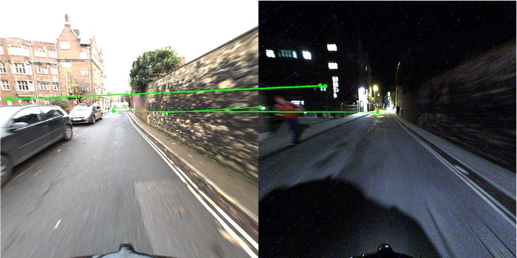
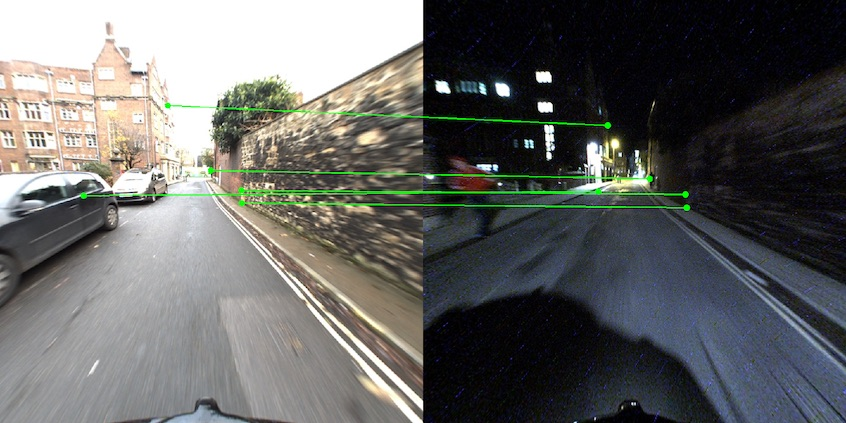
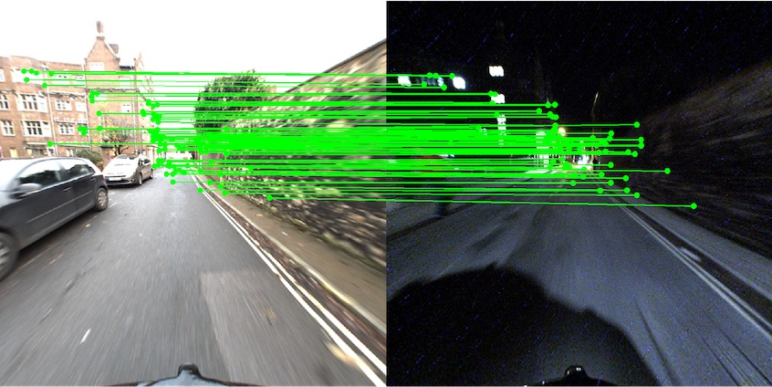
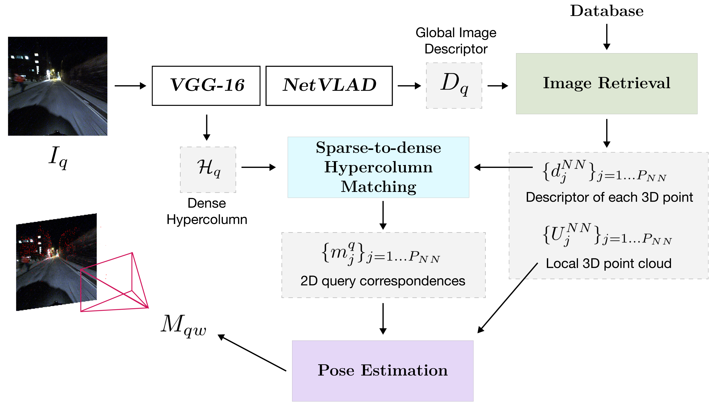

# Sparse-To-Dense Hypercolumn Matching for Long-Term Visual Localization

This is the official repository for the 3DV 2019 paper *[Sparse-To-Dense Hypercolumn Matching for Long-Term Visual Localization](https://arxiv.org/abs/1907.03965)*.
We introduce propose a novel approach to feature point matching,
suitable for robust and accurate outdoor visual localization in long-term scenarios. The proposed solution achieves state-of-the-art accuracy on several outdoor datasets, in challenging categories such as day-to-night or cross-seasonal changes.

The proposed approach __was ranked 2nd in the visual localization challenge__ of the [CVPR 2019 challenge on Long-Term Visual Localization](https://visuallocalization.net) using this codebase, with state-of-the-art results on nighttime and rural environments.

<p align="center">
  
  
  
  <br /><em>Inlier visualization for (from left to right) Superpoint sparse-to-sparse matching, Superpoint detection with hypercolumn sparse-to-sparse matching, and sparse-to-dense hypercolumn matching.</em>
</p>

##


## Installation
Run the following commands to install this repository and the required dependencies:

```bash
git clone https://github.com/germain-hug/S2DHM.git
cd S2D_Hypercolumn_Matching/
git submodule update --init --recursive
pip3 install -r requirements.txt
mkdir -p data/triangulation
```

This code was run and tested on Python 3.7.3, using Pytorch 1.0.1.post2 although it should be compatible with some previous versions. You can follow instructions to install Pytorch [here](https://pytorch.org/).

## Required assets

To run this code, you will first need to download either RobotCar-Seasons or Extended CMU-Seasons from the website of the [CVPR 2019 Challenge](https://visuallocalization.net). Once unpacked, the root of the dataset should be updated accordingly in `s2dm/configs/datasets/<your_dataset>.gin`.  

In addition, we provide a pre-computed reconstruction of both datasets computed using SuperPoint. These triangulations were obtained using scripts borrowed from [HF-Net](https://github.com/ethz-asl/hfnet/tree/master/colmap-helpers), please to their repository for more details. The triangulation `.npz` files can be downloaded from [this link](https://www.dropbox.com/sh/288mo16ji6uva5v/AAD8zULDYNWGFh67EedqBSGra?dl=0), and should be placed under `data/triangulation/`.

The pre-trained weights for the main image retrieval network can be found under
`checkpoints/`.

## Running

<p align="center">
  
  <br /><em>Overview of our sparse-to-dense hypercolumn matching pipeline.</em>
</p>

You can run either of the following modes:

#### Nearest-neigbor pose approximation

This mode predicts the query pose based as the pose of the top-ranked image in the database.

```bash
python3 run.py --dataset [robotcar|cmu] --mode nearest_neighbor
```

#### Sparse-to-sparse SuperPoint matching

This mode predicts the query pose using sparse-to-sparse matching with SuperPoint detections and features in the query image.

```bash
python3 run.py --dataset [robotcar|cmu] --mode superpoint
```

#### Sparse-to-dense hypercolumn matching

This mode performs sparse-to-dense hypercolumn matching, as per the figure above.

```bash
python3 run.py --dataset [robotcar|cmu] --mode sparse_to_dense
```


## Performance validation

After running, a `.txt` file is produced and saved under `results/`. This is the file that should be uploaded to the CVPR 2019 Visual Localization Challenge [website](https://visuallocalization.net) to obtain the quantitative results.

## Visualization

To export image logs in `logs/` (to allow for visual comparison of the approach) you can add the `--log_images` argument when running the pipeline.

## Configuration files

This codebase uses the [gin](https://github.com/google/gin-config) configuration file system to store all high-level parameters.
All configuration files can be found under `s2dm/configs/` and can be used to update most of the hyper-parameters and data paths.
At runtime, hyperparameters being used will be printed.

## Adding your own dataset

This repository provides code to run the pipeline on two dataset: RobotCar-Seasons and Extended CMU-Seasons. It can however be setup for your own dataset.  

To do so, you should create a new class inheriting `BaseDataset` and stored under `s2dm/datasets/<your_dataset>.py`. You can look at the `robotcar_dataset.py` or `cmu_dataset.py` for inspiration.  

Then, you will have to add a new config file for your dataset in `s2dm/datasets/<your_dataset>.gin` and reference it in a new run gin config file under `s2dm/runs/run_<mode>_on<your_dataset>.gin`.

Lastly, you will have to make sure that you have a reconstruction `.npz` file stored in `data/triangulation/`. Please refer to the [HF-Net](https://github.com/ethz-asl/hfnet/tree/master/colmap-helpers) repository to compute such files using COLMAP.

## Citation

Please consider citing the corresponding publication if you use this work:
```
@inproceedings{germain2019sparsetodense,
  title={Sparse-To-Dense Hypercolumn Matching for Long-Term Visual Localization},
  author={Germain, H. and Bourmaud, G. and Lepetit, V.},
  article={International Conference on 3D Vision (3DV)},
  year={2019}
}
```
